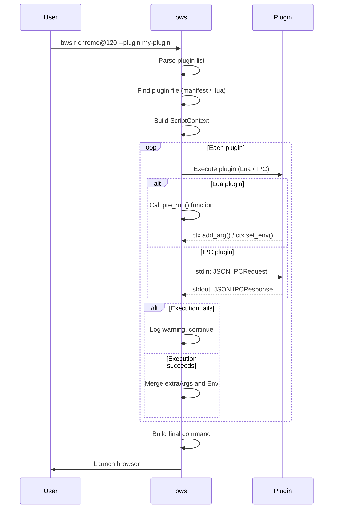

# Plugin System

bws plugin system allows you to execute custom logic automatically when launching a browser. Plugins can modify startup arguments, set environment variables, write configuration files — enabling features like workspace-aware launching, auto-loading extensions, and enhanced fingerprint isolation.

## Plugin Types

bws supports two plugin types covering all scenarios from simple to complex:

| Type | File Format | Runtime | Use Case |
|------|------------|---------|----------|
| **Lua Script** | `.lua` | Built-in Lua engine | Simple logic: modify args, write config files, read config |
| **IPC Plugin** | Executable (`.py`, `.exe`, `.sh`, etc.) | Separate process + stdin/stdout JSON-RPC | Complex logic: CDP operations, screenshots, external API calls, network requests |

**How to choose:**
- Only need to modify start args or write files? → **Lua plugin** (zero dependencies, no runtime needed)
- Need network requests, databases, or external tools? → **IPC plugin** (any language)

## Plugin Directory

Plugins are stored in the `bws-data/plugins/` directory (next to the bws executable in portable mode), created automatically on first `bws plugin install`.

## Quick Start

### Lua Plugin

Create a `.lua` file with a `pre_run` function:

```lua
-- hello.lua
function pre_run()
    ctx.log("Hello from plugin! Browser: " .. ctx.browser)
end
```

Install and run:

```bash
# Install the plugin
bws plugin install hello.lua

# Launch browser with the plugin
bws r chrome@120 --plugin hello
```

### IPC Plugin (Python)

Write an executable script in any language, reading JSON from stdin and writing JSON to stdout:

```python
#!/usr/bin/env python3
# hello.py
import sys, json
req = json.loads(sys.stdin.read())
resp = {"extraArgs": ["--disable-background-timer-throttling"]}
print(json.dumps(resp))
```

Install and run:

```bash
# Install (executable keeps original filename and permissions)
bws plugin install hello.py

# Launch browser with the plugin
bws r chrome@120 --plugin hello.py
```

## Plugin Management Commands

| Command | Description |
|---------|-------------|
| `bws pl list` | List installed plugins |
| `bws pl install <name\|url\|path>` | Install plugin (local file, Registry, Git URL) |
| `bws pl uninstall <name>` | Uninstall a plugin |
| `bws pl search <query>` | Search plugins in the Registry |

**Note:** `pl` is the short alias for `plugin`. `bws pl l` = `bws plugin list`.

## Lifecycle Hooks

| Hook | Timing | Description |
|------|--------|-------------|
| `pre_run` | Before browser launch | Modify start args, write config files, set env vars |

Future hooks planned:
- `post_run`: After browser launch, for screenshots, automation testing, etc.
- `pre_install` / `post_install`: Before/after plugin installation

## IPC Protocol Reference

IPC plugins communicate with bws via stdin/stdout JSON-RPC.

### Request Format (bws → plugin stdin)

```json
{
  "event": "pre_run",
  "browser": "chrome",
  "version": "120",
  "profile": "default",
  "profileDir": "/path/to/profile"
}
```

| Field | Type | Description |
|-------|------|-------------|
| `event` | string | Current event (currently always `pre_run`) |
| `browser` | string | Browser name |
| `version` | string | Version number |
| `profile` | string | Profile name |
| `profileDir` | string | Profile directory absolute path |

### Response Format (plugin stdout → bws)

```json
{
  "extraArgs": ["--disable-background-timer-throttling"],
  "env": {"MY_VAR": "value"},
  "error": ""
}
```

| Field | Type | Description |
|-------|------|-------------|
| `extraArgs` | string[] | Extra arguments appended to the browser command |
| `env` | object | Environment variables to set (key-value pairs) |
| `error` | string | Error message; if non-empty, bws logs a warning and skips this plugin |

**Note:** Plugins can print log lines to stderr around the JSON output — bws displays them normally. Only the first JSON object is parsed as the response.

### Timeout Control

IPC plugins have a **10-second timeout**. On timeout, bws terminates the plugin process, logs a warning, and continues to the next plugin without blocking browser launch.

## ctx API Reference (Lua Plugins)

Lua plugins access browser context and bws features through the `ctx` object.

### Read-Only Fields

| Field | Type | Description |
|-------|------|-------------|
| `ctx.browser` | string | Browser name, e.g. `"chrome"`, `"firefox"`, `"chromium"` |
| `ctx.version` | string | Version number |
| `ctx.profile` | string | Profile name (set via `--profile`) |
| `ctx.profile_dir` | string | Profile directory absolute path |

### Functions

| Function | Parameters | Returns | Description |
|----------|-----------|---------|-------------|
| `ctx.config(key)` | string | string | Read bws config value, e.g. `ctx.config("proxy")` |
| `ctx.add_arg(arg)` | string | - | Add a browser launch argument |
| `ctx.set_env(key, value)` | string, string | - | Set an environment variable |
| `ctx.write_file(path, content)` | string, string | nil / string | Write a file; returns nil on success, or error string on failure |
| `ctx.read_file(path)` | string | string, string | Read a file; returns (content, error) |
| `ctx.log(message)` | string | - | Log a message to stderr |

### Lua Security Sandbox

Lua plugins run in a sandbox with access limited to the following standard libraries: `base`, `string`, `table`, `math`. **Access to** `os`, `io`, `package`, `debug`, `ffi` and other dangerous libraries is **prohibited**, ensuring plugins cannot execute system commands or access arbitrary files (only controlled file operations via the `ctx` API).

## Example Walkthroughs

All examples below are available in the repository's [`plugins/examples/`](https://github.com/hyjiacan/browser-workshop/tree/master/plugins/examples) directory.

### 1. auto-arg.lua: Auto-Add Args by Browser

[View full source](https://github.com/hyjiacan/browser-workshop/blob/master/plugins/examples/auto-arg.lua)

The simplest Lua plugin example, showing how to add different startup arguments based on browser type:

```lua
-- auto-arg.lua
function pre_run()
    if ctx.browser == "chrome" or ctx.browser == "chromium" then
        ctx.add_arg("--disable-background-timer-throttling")
        ctx.add_arg("--disable-renderer-backgrounding")
    end
    if ctx.browser == "firefox" then
        ctx.log("auto-arg: firefox detected, adding devtools flag")
    end
end
```

**Install:** `bws pl install ./plugins/examples/auto-arg.lua`
**Run:** `bws r chrome@120 --plugin auto-arg`

**Key takeaways:**
- `ctx.browser` to check browser type
- `ctx.add_arg()` to add launch arguments
- `ctx.log()` for logging
- The `.lua` extension is stripped on install; the plugin name becomes `auto-arg`

### 2. fingerprint-enhanced.lua: Enhanced Fingerprint Protection

[View full source](https://github.com/hyjiacan/browser-workshop/blob/master/plugins/examples/fingerprint-enhanced.lua)

Demonstrates combining bws built-in fingerprint isolation with custom enhancement logic:

```lua
-- fingerprint-enhanced.lua
function pre_run()
    -- WebRTC protection
    if ctx.browser == "chrome" or ctx.browser == "chromium" then
        ctx.add_arg("--force-webrtc-ip-handling-policy=disable_non_proxied_udp")
        ctx.add_arg("--enforce-webrtc-local-ip-allowed-check")
        ctx.add_arg("--use-fake-device-for-media-stream")
        ctx.add_arg("--use-fake-ui-for-media-stream")
    end

    -- Firefox: write user.js
    if ctx.browser == "firefox" and ctx.profile_dir ~= "" then
        local prefs = [[
user_pref("privacy.resistFingerprinting", true);
user_pref("privacy.resistFingerprinting.letterboxing", true);
user_pref("media.peerconnection.enabled", false);
user_pref("geo.enabled", false);
]]
        local err = ctx.write_file(ctx.profile_dir .. "/user.js", prefs)
        if err ~= nil then
            ctx.log("fingerprint-enhanced: failed to write user.js: " .. err)
        else
            ctx.log("fingerprint-enhanced: Firefox fingerprint prefs applied")
        end
    end
end
```

**Install:** `bws pl install ./plugins/examples/fingerprint-enhanced.lua`
**Run with `--fingerprint random`:**

```bash
bws r chrome@120 --fingerprint random --plugin fingerprint-enhanced
```

**Key takeaways:**
- `ctx.profile_dir` for profile directory path
- `ctx.write_file()` with error checking
- Combining with bws built-in `--fingerprint` option
- Lua multiline string syntax with `[[...]]`

### 3. workspace.lua: Workspace-Aware Launch

[View full source](https://github.com/hyjiacan/browser-workshop/blob/master/plugins/examples/workspace.lua)

Demonstrates switching browser behavior based on bws configuration, ideal for dev/test/prod environments:

```lua
-- workspace.lua
function pre_run()
    local workspace = ctx.config("workspace") or "default"
    ctx.log("workspace.lua: active workspace = " .. workspace)

    -- Workspace A: dev environment
    if workspace == "dev" then
        ctx.add_arg("--auto-open-devtools-for-tabs")
        ctx.set_env("NODE_ENV", "development")
        ctx.log("workspace.lua: dev mode enabled")
        return
    end

    -- Workspace B: test environment
    if workspace == "test" then
        ctx.add_arg("--headless")
        ctx.add_arg("--disable-gpu")
        ctx.set_env("NODE_ENV", "test")
        ctx.log("workspace.lua: test mode enabled")
        return
    end

    -- Workspace C: production environment (strict mode)
    if workspace == "prod" then
        ctx.add_arg("--incognito")
        ctx.add_arg("--no-first-run")
        ctx.log("workspace.lua: prod mode enabled")
        return
    end

    ctx.log("workspace.lua: default mode")
end
```

**Install:** `bws pl install ./plugins/examples/workspace.lua`
**Configure workspace:**

```bash
# Set workspace to dev
bws cfg set workspace dev

# Run
bws r chrome@120 --plugin workspace
```

**Key takeaways:**
- `ctx.config()` to read bws config values
- `ctx.set_env()` to set environment variables
- `bws cfg set` command working together with plugins
- Early `return` to exit the function

### 4. browser-alias.py: Python IPC Plugin

[View full source](https://github.com/hyjiacan/browser-workshop/blob/master/plugins/examples/browser-alias.py)

Demonstrates writing an IPC plugin in Python that adds fixed arguments per browser:

```python
#!/usr/bin/env python3
# browser-alias.py: Add fixed browser alias and launch args
import sys
import json

# Read context from bws
req = json.loads(sys.stdin.read())
resp = {}

browser = req.get("browser", "")
version = req.get("version", "")

# Add fixed arguments based on browser type
if browser in ("chrome", "chromium"):
    resp["extraArgs"] = [
        "--disable-background-timer-throttling",
        "--disable-renderer-backgrounding",
    ]
elif browser == "firefox":
    resp["extraArgs"] = []

# Output response
print(json.dumps(resp))
```

**Install:** `bws pl install ./plugins/examples/browser-alias.py`
**Run:** `bws r chrome@120 --plugin browser-alias.py`

**Note:** IPC plugins keep their original filename (with extension) on install, so `--plugin` needs the full filename `browser-alias.py`, not `browser-alias`.

**Key takeaways:**
- IPC plugins use stdin/stdout communication
- Request fields: `browser`, `version`, etc.
- Response fields: `extraArgs`
- Can be written in any language (Python, Node.js, Go, Rust, etc.)

## Plugin Execution Flow



## Publishing Plugins

### Publishing to Registry

1. Create a GitHub/Gitee repository named e.g. `bws-plugin-xxx`
2. Write plugin code and README documentation
3. Publish a Release
4. Submit a PR to the official Registry: add an entry to [registry.json](https://github.com/hyjiacan/browser-workshop/blob/master/plugins/registry.json)

### Registry Entry Format

The plugin Registry is a JSON index file. Each plugin entry looks like:

```json
{
  "name": "fingerprint-enhanced",
  "description": "Enhanced fingerprint isolation plugin",
  "author": "your-name",
  "source": "https://github.com/your-name/bws-plugin-fingerprint-enhanced",
  "type": "lua",
  "latest": "1.0.0",
  "versions": {
    "1.0.0": {
      "url": "https://github.com/.../releases/.../fingerprint-enhanced.lua",
      "hash": "sha256:...",
      "platforms": ["all"]
    }
  },
  "tags": ["fingerprint", "privacy", "security"]
}
```

Once the PR is merged, users can search (`bws pl search`) and install (`bws pl install fingerprint-enhanced`) your plugin.

## Limitations & Notes

1. **Hook limitation**: Only `pre_run` is supported currently; more hooks will be added in the future
2. **Execution order**: Plugins execute in the order specified by `--plugin`
3. **Lua sandbox**: Lua scripts cannot call external processes or access system commands (security)
4. **IPC timeout**: IPC plugins have a 10-second timeout; the process is killed on timeout
5. **Fault tolerance**: A single plugin failure does not block browser launch; bws logs a warning and continues
6. **Plugin isolation**: Plugins do not share state and have no dependency management

## FAQ

### How to choose between Lua and IPC plugins?

- Only need `ctx.add_arg()`, `ctx.set_env()`, `ctx.write_file()` → **Lua plugin** (zero dependencies)
- Need network requests, databases, external tools → **IPC plugin** (any language)

### Why do some plugin names have extensions and others don't?

- **Lua plugins** (`.lua`): The `.lua` extension is stripped on install; use the short name with `--plugin`, e.g. `--plugin auto-arg`
- **IPC plugins** (non-`.lua`): The original filename is kept; use the full filename with `--plugin`, e.g. `--plugin browser-alias.py`

### How to debug plugins?

- Lua plugins: Use `ctx.log()` for logging; output appears in the console
- IPC plugins: Anything written to stderr is displayed by bws
- Use `bws r chrome@120 --dry-run` to preview the final command

### Can I use multiple plugins at once?

Yes, separate with commas:

```bash
bws r chrome@120 --plugin auto-arg,fingerprint-enhanced,workspace
```

Plugins execute in order; later plugins can override arguments added by earlier ones.