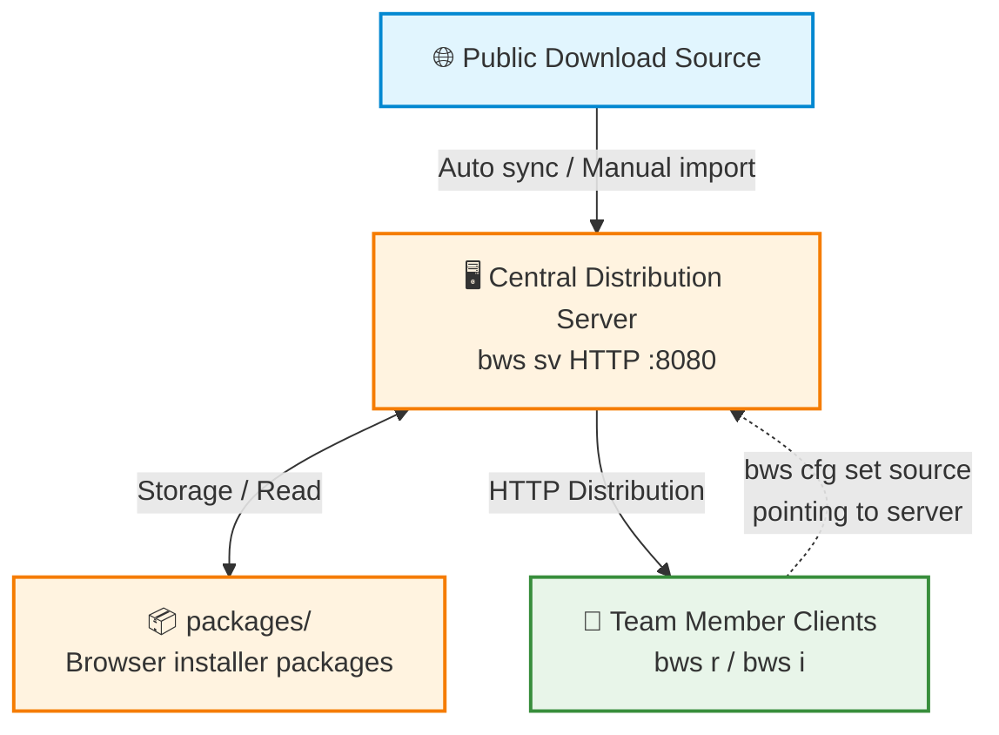

# Team Offline Deployment Solution

In enterprise intranets or environments without external internet access, you can run `bws sv` on a server to build a central distribution service, allowing team members to uniformly obtain and run browser versions from that server.

## Architecture Overview



The diagram above shows the complete team offline deployment architecture:

1. **Public download source**: GitHub Release, Firefox FTP, Chromium GCS, chromedownloads.net, and other official and third-party sources
2. **Central distribution server**: Runs `bws sv`, responsible for syncing browser installer packages from the public internet and storing them in the `packages/` directory
3. **Team member clients**: Run `bws r` / `bws i`, obtaining browser versions from the server via the LAN
4. **Data flow**: Server syncs from public internet -> Team members install/run from server

## Deployment Steps

### 1. Server Side

#### 1. Install bws

```bash
# Place the bws executable on the server and ensure it has execution permissions
# Confirm successful installation
bws version
```

#### 2. Configure bws-serve.ini

The first time you run `bws sv`, a default configuration file is automatically generated; edit it and restart.

```bash
bws sv
# Output: Configuration file created: /opt/bws/bws-serve.ini
# Edit the configuration file, then rerun
```

Recommended server configuration:

```ini
[serve]
host = 0.0.0.0
port = 8080
packages-dir =
bin-dir =
sync = true
sync-interval = 24h
sync-browsers = chrome,firefox,chromium
sync-channels = stable
```

Key configuration items:

| Config Item | Recommended Value | Description |
|-------------|-------------------|-------------|
| `host` | `0.0.0.0` | Listen on all network interfaces, allowing LAN access |
| `port` | `8080` | Service port; team members access via this port |
| `sync` | `true` | Enable automatic sync; periodically pull latest versions from public internet |
| `sync-interval` | `24h` | Sync interval; adjust according to team needs |
| `sync-browsers` | `chrome,firefox` | Only sync browsers needed by the team |

#### 3. Start the Service

```bash
bws sv
```

After starting, you can visit `http://server:8080` in a browser to view the web management interface and confirm the service is running normally.

> For production environments, it is recommended to register `bws sv` as a system service to achieve auto-start on boot and automatic restart. For detailed methods, please refer to the [Serve Service](./serve.md#running-in-background) chapter.

### 2. Client Side

#### 1. Install bws

```bash
# Place the bws executable on the client machine
bws version
```

#### 2. Configure Offline Source

Point the source to the team internal distribution server:

```bash
bws cfg set source http://server:8080
```

Replace `server:8080` with the actual distribution server address. For example, if the intranet IP is `192.168.1.100`:

```bash
bws cfg set source http://192.168.1.100:8080
```

#### 3. Verify Connectivity

```bash
bws ls --remote
```

If you can see the browser version list from the server, the configuration is successful.

### 3. Daily Use

After configuration is complete, the normal use flow for team members:

```bash
# View available browser versions on the server
bws ls --remote

# Install a specific version
bws i chrome@120

# Run a specific version
bws r chrome@120

# View locally installed versions
bws ls
```

After the client configures the offline source, all `bws i` and `bws ls --remote` operations will prioritize fetching from the server; versions not available on the server will automatically fall back to the built-in online source.

## Solution Advantages

### Bandwidth Savings

The server only downloads once from the public internet, and all members on the LAN share the same installer package. For a 10-person team installing Chrome 120, for example, external downloads are reduced from 10 times to 1 time, saving approximately 90% of external bandwidth.

### Faster Downloads

LAN transfer speeds are typically much higher than external download speeds; clients obtaining installer packages from the internal server can significantly reduce wait times.

### Unified Version Control

Administrators control the browser versions and channels synced on the server, ensuring all team members use consistent browser versions and avoiding compatibility issues caused by version differences. Combined with automatic sync policies, new versions can be promptly pushed to the team.
