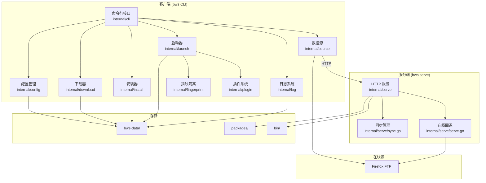
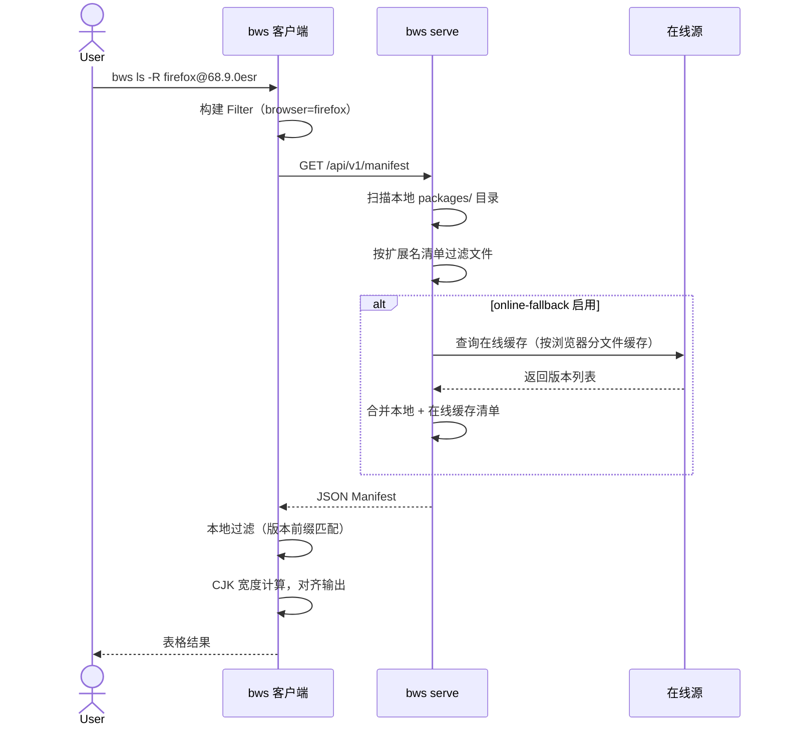
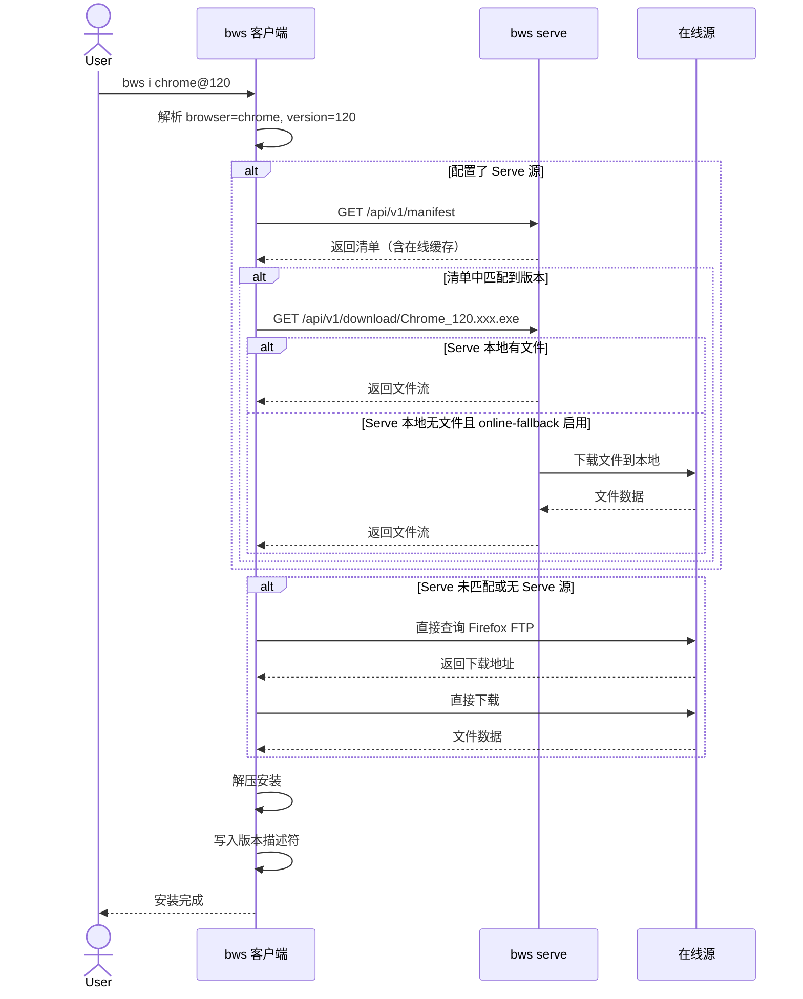
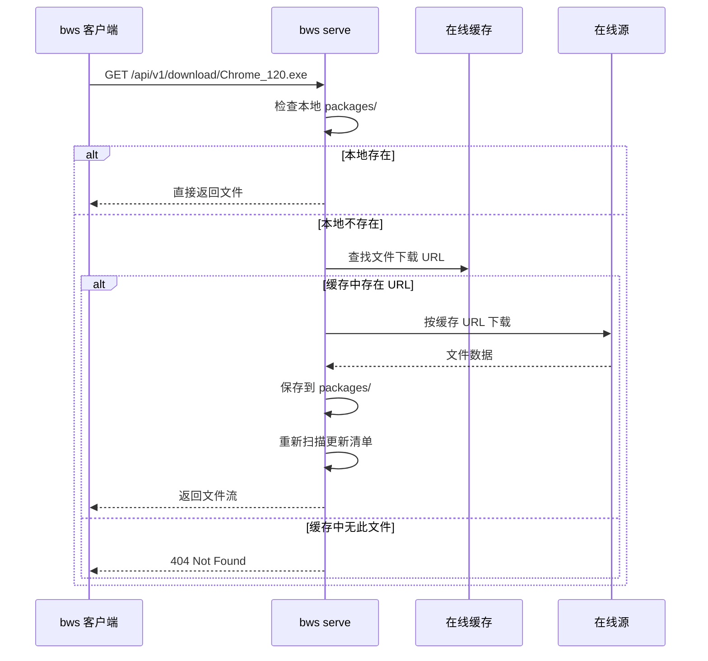
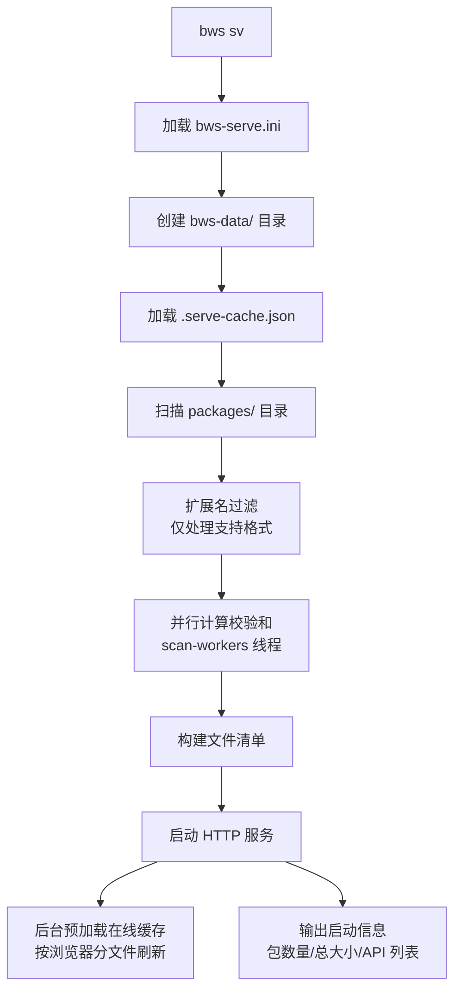
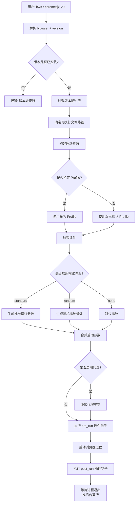
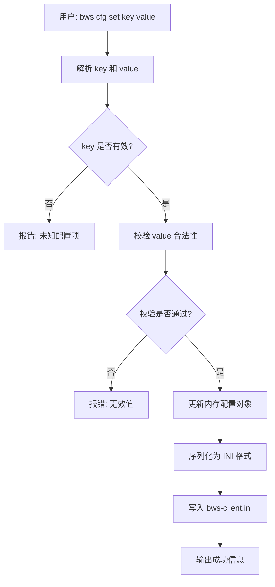
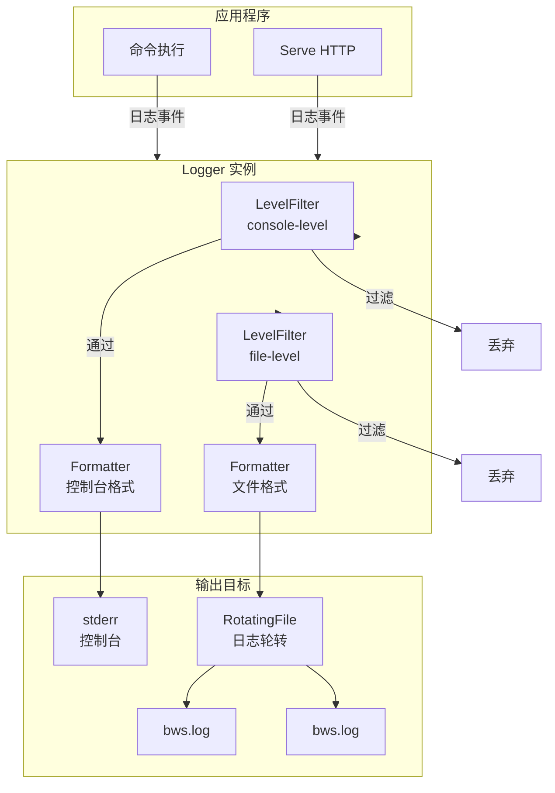
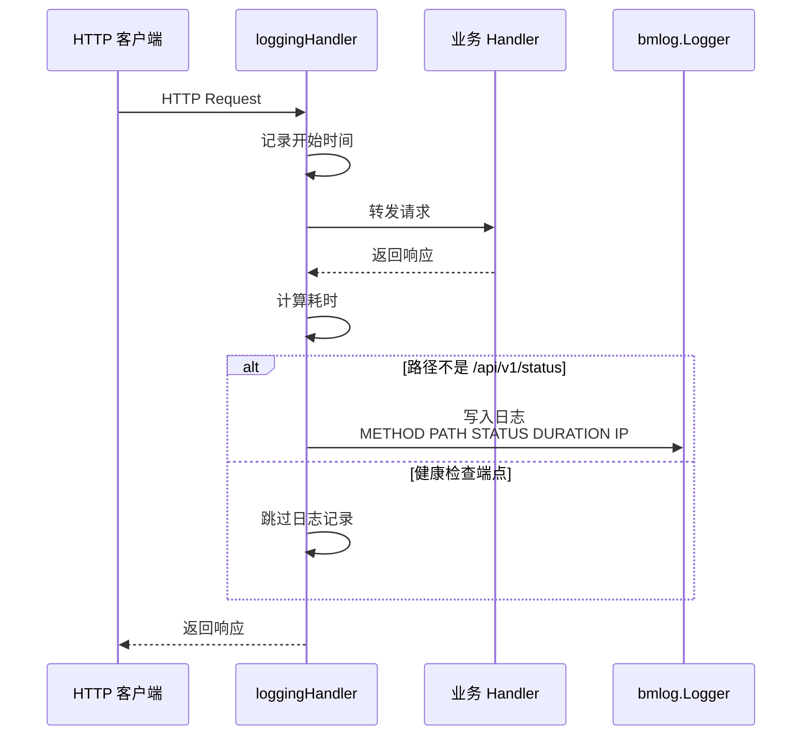
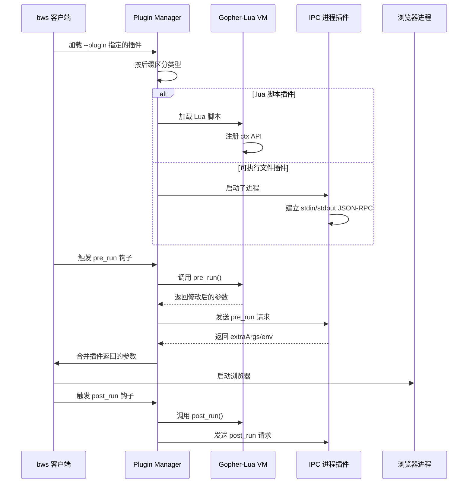

# 架构设计

本文档描述 Browser Workshop 的整体架构设计、核心数据流、工作流程和交互时序，作为后续版本迭代的开发依据。

## 系统架构

bws 由客户端（CLI）和服务端（Serve）两部分组成，采用 Go 语言实现，所有数据以文件形式存储，无需外部数据库。

### 架构概览



### 模块职责

| 模块 | 职责 |
|------|------|
| `internal/cli` | 命令解析、参数处理、命令分发 |
| `internal/config` | INI 配置读写、默认值管理 |
| `internal/source` | 多数据源抽象（Serve HTTP、Firefox FTP） |
| `internal/download` | 并发下载、断点续传、重试机制 |
| `internal/install` | 浏览器安装、压缩包解压、文件识别 |
| `internal/launch` | 浏览器启动、参数构建、Profile 管理 |
| `internal/fingerprint` | 指纹隔离参数生成（User-Agent、分辨率、WebRTC 等） |
| `internal/plugin` | Lua 脚本插件和 IPC 进程插件管理 |
| `internal/log` | 双输出日志（文件+控制台）、级别控制、日志轮转 |
| `internal/serve` | HTTP 服务、文件分发、清单生成、在线回退 |

---

## 客户端与服务端交互

### 清单查询时序

客户端执行 `bws ls -R <browser>` 时的完整交互流程：



### 安装流程时序

客户端执行 `bws i chrome@120` 时的完整交互流程：



### 在线回退详细时序

当 Serve 启用 `online-fallback` 且客户端请求的文件本地不存在时：



---

## 核心数据流

### 版本查询数据流


### Serve 启动数据流



---

## 工作流程

### 浏览器启动工作流程



### 配置管理工作流程



---

## 日志系统架构

### 日志输出架构



### HTTP 请求日志流程



---

## 插件系统架构

### 插件执行流程



---

## 数据模型

### 版本信息（VersionInfo）

```go
type VersionInfo struct {
    Browser      string   // 浏览器名称: chrome, firefox, chromium
    Version      string   // 完整版本号: 120.0.6099.109
    Channel      Channel  // 发布渠道: stable, beta, dev, canary, esr
    Platform     Platform // 平台: windows, linux, macos
    Arch         Arch     // 架构: amd64, 386, arm64
    DownloadURL  string   // 下载地址
    Size         int64    // 文件大小（字节）
    SHA256       string   // 校验和
}
```

### 配置文件结构（INI）

```ini
[client]
default-browser = chrome
default-channel = stable
language = zh
data-dir =
repo-path =
remote-source =

[log]
console-level = info
file-level = debug
max-size-mb = 10
max-backups = 5

[download]
max-concurrency = 3
retry-count = 3
retry-delay = 2s
timeout = 30m

[cache]
manifest-ttl = 24h
download-ttl = 168h

[source-switches]
enable-serve-source = true
enable-firefox-ftp = true

[network]
proxy =
disk-space-threshold-gb = 5
```

### Serve 配置文件结构（INI）

```ini
[serve]
host = 0.0.0.0
port = 8080
packages-dir =
bin-dir =
sync = false
sync-interval = 24h
sync-browsers =
sync-channels = stable
online-fallback = true
scan-workers = 0
```

---

## 关键设计决策

### 1. 无数据库设计

所有数据以文件形式存储（INI 配置、JSON 缓存、文件系统作为版本仓库），无需外部依赖，便于便携和备份。

### 2. 数据源优先级

固定优先级：**Serve 离线源 > Firefox FTP**。优先级不可配置，通过开关控制各源启用/禁用。

### 3. 单配置文件管理

客户端配置和 Serve 配置完全分离，均位于与 bws 可执行文件同目录下：
- 客户端：`bws-client.ini`（INI 格式）
- Serve：`bws-serve.ini`（INI 格式）

不再支持 JSON 格式，不保留向后兼容。

### 4. 并发控制

- **下载并发**：通过 `download.max-concurrency` 控制（默认 3）
- **扫描并发**：通过 `serve.scan-workers` 控制（默认 CPU 核心数）
- **在线回退去重**：使用 `dlMu + dlInflight` map 确保同一文件并发下载只触发一次

### 5. 缓存策略

- **清单缓存**：`cache.manifest-ttl`（默认 24h），`--refresh` 强制刷新
- **下载缓存**：`cache.download-ttl`（默认 168h）
- **Firefox FTP 缓存**：独立缓存文件 `firefox-ftp-cache.json`，24h 有效期
- **Serve 在线缓存**：`onlineCacheTTL`（24 小时），按浏览器分文件存储（`online-cache-<browser>.json`），`onlineListTimeout`（30 秒）

### 6. 日志共用

客户端和 Serve 共用同一日志文件：
- 客户端和 Serve 均写入：`logs/bws.log`
- 日志级别、轮转参数可分别配置
