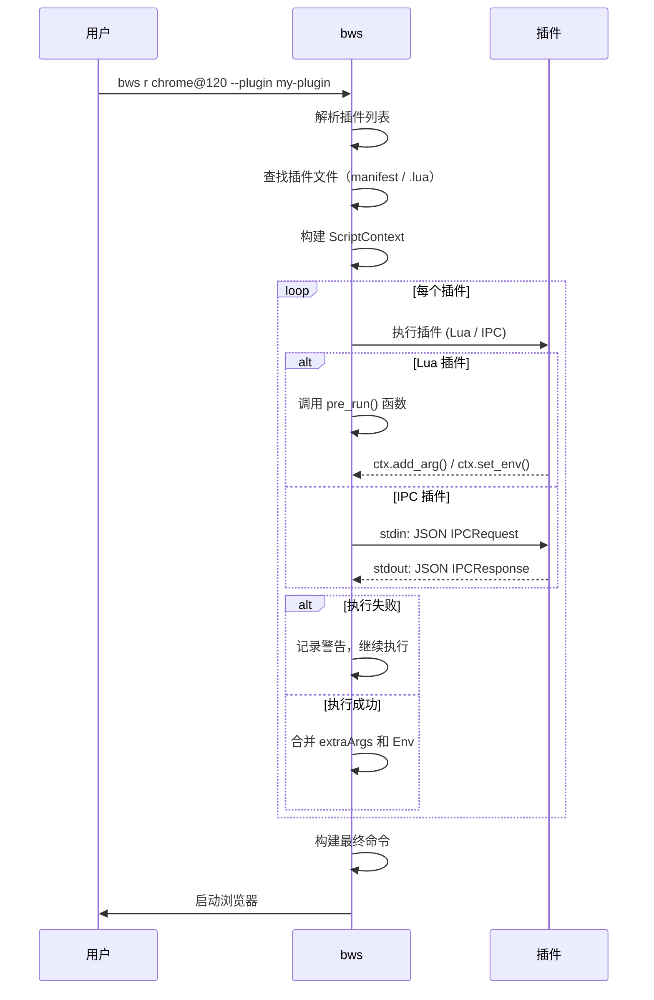

# 插件系统

bws 的插件系统允许你在浏览器启动时自动执行自定义逻辑。插件可以修改启动参数、设置环境变量、写入配置文件，实现诸如工作空间感知启动、自动加载扩展、增强指纹隔离等功能。

## 插件类型

bws 支持两种插件类型，覆盖从简单到复杂的所有场景：

| 类型 | 文件格式 | 运行方式 | 适用场景 |
|------|---------|---------|---------|
| **Lua 脚本** | `.lua` | bws 内置 Lua 引擎 | 简单逻辑：修改启动参数、写配置文件、读取配置 |
| **IPC 插件** | 可执行文件（`.py`、`.exe`、`.sh` 等） | 独立进程 + stdin/stdout JSON-RPC | 复杂逻辑：CDP 操作、截图、外部 API 调用、网络请求 |

**选择建议：**
- 只需修改启动参数或写文件？→ **Lua 插件**（零依赖，无需安装运行时）
- 需要网络请求、数据库操作或调用外部工具？→ **IPC 插件**（可用任何语言）

## 插件目录

插件存放在 `bws-data/plugins/` 目录下（便携模式下与 bws 可执行文件同级），首次运行 `bws plugin install` 时自动创建。

## 快速开始

### Lua 插件

创建一个 `.lua` 文件，定义 `pre_run` 函数：

```lua
-- hello.lua
function pre_run()
    ctx.log("Hello from plugin! Browser: " .. ctx.browser)
end
```

安装并运行：

```bash
# 安装插件
bws plugin install hello.lua

# 使用插件启动浏览器
bws r chrome@120 --plugin hello
```

### IPC 插件（Python）

用任意语言编写可执行脚本，从 stdin 读取 JSON 上下文，往 stdout 输出 JSON 响应：

```python
#!/usr/bin/env python3
# hello.py
import sys, json
req = json.loads(sys.stdin.read())
resp = {"extraArgs": ["--disable-background-timer-throttling"]}
print(json.dumps(resp))
```

安装并运行：

```bash
# 安装插件（可执行文件保留原文件名和权限）
bws plugin install hello.py

# 使用插件启动浏览器
bws r chrome@120 --plugin hello.py
```

## 插件管理命令

| 命令 | 说明 |
|------|------|
| `bws pl list` | 列出已安装插件 |
| `bws pl install <name\|url\|path>` | 安装插件（本地文件、Registry、Git URL） |
| `bws pl uninstall <name>` | 卸载插件 |
| `bws pl search <query>` | 搜索 Registry 中的插件 |

**缩写说明：** `pl` 是 `plugin` 的别名，`bws pl l` = `bws plugin list`。

## 生命周期钩子

| 钩子 | 触发时机 | 说明 |
|------|---------|------|
| `pre_run` | 浏览器启动前 | 修改启动参数、写入配置文件、设置环境变量 |

未来计划扩展的钩子：
- `post_run`：浏览器启动后，可用于截图、自动化测试等
- `pre_install` / `post_install`：插件安装前后

## IPC 协议参考

IPC 插件通过 stdin/stdout JSON-RPC 与 bws 通信。

### 请求格式（bws → 插件 stdin）

```json
{
  "event": "pre_run",
  "browser": "chrome",
  "version": "120",
  "profile": "default",
  "profileDir": "/path/to/profile"
}
```

| 字段 | 类型 | 说明 |
|------|------|------|
| `event` | string | 当前事件（当前固定为 `pre_run`） |
| `browser` | string | 浏览器名称 |
| `version` | string | 版本号 |
| `profile` | string | Profile 名称 |
| `profileDir` | string | Profile 目录绝对路径 |

### 响应格式（插件 stdout → bws）

```json
{
  "extraArgs": ["--disable-background-timer-throttling"],
  "env": {"MY_VAR": "value"},
  "error": ""
}
```

| 字段 | 类型 | 说明 |
|------|------|------|
| `extraArgs` | string[] | 追加到浏览器启动命令的额外参数 |
| `env` | object | 需要设置的环境变量（键值对） |
| `error` | string | 错误信息，非空时 bws 会记录警告并跳过该插件 |

**注意：** 插件可以在 JSON 输出前后打印日志到 stderr，bws 会正常显示。只有第一个 JSON 对象会被解析为响应。

### 超时控制

IPC 插件有 **10 秒超时限制**。超时后 bws 会终止插件进程，记录警告并继续执行后续插件，不会阻断浏览器启动。

## ctx API 参考（Lua 插件）

Lua 插件可以通过 `ctx` 对象访问浏览器上下文和 bws 功能。

### 只读字段

| 字段 | 类型 | 说明 |
|------|------|------|
| `ctx.browser` | string | 浏览器名称，如 `"chrome"`、`"firefox"`、`"chromium"` |
| `ctx.version` | string | 版本号 |
| `ctx.profile` | string | Profile 名称（用户通过 `--profile` 指定） |
| `ctx.profile_dir` | string | Profile 目录绝对路径 |

### 函数

| 函数 | 参数 | 返回值 | 说明 |
|------|------|--------|------|
| `ctx.config(key)` | string | string | 读取 bws 配置项，如 `ctx.config("proxy")` |
| `ctx.add_arg(arg)` | string | - | 添加浏览器启动参数 |
| `ctx.set_env(key, value)` | string, string | - | 设置环境变量 |
| `ctx.write_file(path, content)` | string, string | nil / string | 写入文件，成功返回 nil，失败返回错误字符串 |
| `ctx.read_file(path)` | string | string, string | 读取文件，返回 (内容, 错误) |
| `ctx.log(message)` | string | - | 输出日志到 stderr |

### Lua 安全沙箱

Lua 插件运行在安全沙箱中，仅可访问以下标准库：`base`、`string`、`table`、`math`。**禁止访问** `os`、`io`、`package`、`debug`、`ffi` 等危险库，确保插件无法执行系统命令或访问任意文件（只能通过 `ctx` API 进行受控的文件操作）。

## 示例详解

以下示例均可在仓库的 [`plugins/examples/`](https://gitee.com/hyjiacan/browser-workshop/tree/master/plugins/examples) 目录中找到。

### 1. auto-arg.lua：按浏览器自动添加参数

[查看完整代码](https://gitee.com/hyjiacan/browser-workshop/blob/master/plugins/examples/auto-arg.lua)

最简单的 Lua 插件示例，演示如何根据浏览器类型添加不同的启动参数：

```lua
-- auto-arg.lua
function pre_run()
    if ctx.browser == "chrome" or ctx.browser == "chromium" then
        ctx.add_arg("--disable-background-timer-throttling")
        ctx.add_arg("--disable-renderer-backgrounding")
    end
    if ctx.browser == "firefox" then
        ctx.log("auto-arg: firefox detected, adding devtools flag")
    end
end
```

**安装：** `bws pl install ./plugins/examples/auto-arg.lua`
**运行：** `bws r chrome@120 --plugin auto-arg`

**学习要点：**
- `ctx.browser` 判断浏览器类型
- `ctx.add_arg()` 添加启动参数
- `ctx.log()` 输出日志
- 文件名 `.lua` 后缀在安装时会被去除，插件名即为 `auto-arg`

### 2. fingerprint-enhanced.lua：增强版指纹隔离

[查看完整代码](https://gitee.com/hyjiacan/browser-workshop/blob/master/plugins/examples/fingerprint-enhanced.lua)

演示如何结合 bws 内置指纹功能和自定义增强逻辑：

```lua
-- fingerprint-enhanced.lua
function pre_run()
    -- 通用 WebRTC 防护
    if ctx.browser == "chrome" or ctx.browser == "chromium" then
        ctx.add_arg("--force-webrtc-ip-handling-policy=disable_non_proxied_udp")
        ctx.add_arg("--enforce-webrtc-local-ip-allowed-check")
        ctx.add_arg("--use-fake-device-for-media-stream")
        ctx.add_arg("--use-fake-ui-for-media-stream")
    end

    -- Firefox: 写入 user.js
    if ctx.browser == "firefox" and ctx.profile_dir ~= "" then
        local prefs = [[
user_pref("privacy.resistFingerprinting", true);
user_pref("privacy.resistFingerprinting.letterboxing", true);
user_pref("media.peerconnection.enabled", false);
user_pref("geo.enabled", false);
]]
        local err = ctx.write_file(ctx.profile_dir .. "/user.js", prefs)
        if err ~= nil then
            ctx.log("fingerprint-enhanced: failed to write user.js: " .. err)
        else
            ctx.log("fingerprint-enhanced: Firefox fingerprint prefs applied")
        end
    end
end
```

**安装：** `bws pl install ./plugins/examples/fingerprint-enhanced.lua`
**运行：** 与 `--fingerprint random` 配合使用：

```bash
bws r chrome@120 --fingerprint random --plugin fingerprint-enhanced
```

**学习要点：**
- `ctx.profile_dir` 获取 profile 目录路径
- `ctx.write_file()` 写入文件并检查错误
- 结合 bws 内置 `--fingerprint` 选项一起使用
- 使用 Lua 的 `[[...]]` 多行字符串语法

### 3. workspace.lua：工作空间感知启动

[查看完整代码](https://gitee.com/hyjiacan/browser-workshop/blob/master/plugins/examples/workspace.lua)

演示如何根据 bws 配置自动切换浏览器行为，适合开发/测试/生产环境切换：

```lua
-- workspace.lua
function pre_run()
    local workspace = ctx.config("workspace") or "default"
    ctx.log("workspace.lua: active workspace = " .. workspace)

    -- 工作空间 A：开发环境
    if workspace == "dev" then
        ctx.add_arg("--auto-open-devtools-for-tabs")
        ctx.set_env("NODE_ENV", "development")
        ctx.log("workspace.lua: dev mode enabled")
        return
    end

    -- 工作空间 B：测试环境
    if workspace == "test" then
        ctx.add_arg("--headless")
        ctx.add_arg("--disable-gpu")
        ctx.set_env("NODE_ENV", "test")
        ctx.log("workspace.lua: test mode enabled")
        return
    end

    -- 工作空间 C：生产环境（严格模式）
    if workspace == "prod" then
        ctx.add_arg("--incognito")
        ctx.add_arg("--no-first-run")
        ctx.log("workspace.lua: prod mode enabled")
        return
    end

    ctx.log("workspace.lua: default mode")
end
```

**安装：** `bws pl install ./plugins/examples/workspace.lua`
**配置工作空间：**

```bash
# 设置工作空间为开发环境
bws cfg set workspace dev

# 运行
bws r chrome@120 --plugin workspace
```

**学习要点：**
- `ctx.config()` 读取 bws 配置项
- `ctx.set_env()` 设置环境变量
- `bws cfg set` 命令与插件配合使用
- 函数内 `return` 提前退出

### 4. browser-alias.py：Python IPC 插件

[查看完整代码](https://gitee.com/hyjiacan/browser-workshop/blob/master/plugins/examples/browser-alias.py)

演示如何用 Python 编写 IPC 插件，为不同浏览器添加固定启动参数：

```python
#!/usr/bin/env python3
# browser-alias.py: 为浏览器添加固定别名和启动参数
import sys
import json

# 读取 bws 发送的上下文
req = json.loads(sys.stdin.read())
resp = {}

browser = req.get("browser", "")
version = req.get("version", "")

# 根据浏览器类型添加固定参数
if browser in ("chrome", "chromium"):
    resp["extraArgs"] = [
        "--disable-background-timer-throttling",
        "--disable-renderer-backgrounding",
    ]
elif browser == "firefox":
    resp["extraArgs"] = []

# 输出响应
print(json.dumps(resp))
```

**安装：** `bws pl install ./plugins/examples/browser-alias.py`
**运行：** `bws r chrome@120 --plugin browser-alias.py`

**注意：** IPC 插件安装时保留原始文件名（含后缀），因此 `--plugin` 参数需要指定完整的文件名 `browser-alias.py`，而不是 `browser-alias`。

**学习要点：**
- IPC 插件使用 stdin/stdout 通信
- 请求中的 `browser`、`version` 等字段
- 响应中的 `extraArgs` 字段
- 可以用任何语言实现（Python、Node.js、Go、Rust 等）

## 插件执行流程



## 发布插件

### 发布到 Registry

1. 创建 GitHub/Gitee 仓库，命名如 `bws-plugin-xxx`
2. 编写插件代码和 README 文档
3. 发布 Release 版本
4. 向官方 Registry 提交 PR：在 [registry.json](https://gitee.com/hyjiacan/bws/blob/master/plugins/registry.json) 中添加插件条目

### Registry 条目格式

插件 Registry 是一个 JSON 索引文件，每个插件条目包含以下信息：

```json
{
  "name": "fingerprint-enhanced",
  "description": "增强版指纹隔离插件",
  "author": "your-name",
  "source": "https://github.com/your-name/bws-plugin-fingerprint-enhanced",
  "type": "lua",
  "latest": "1.0.0",
  "versions": {
    "1.0.0": {
      "url": "https://github.com/.../releases/.../fingerprint-enhanced.lua",
      "hash": "sha256:...",
      "platforms": ["all"]
    }
  },
  "tags": ["fingerprint", "privacy", "security"]
}
```

Registry 提交后，其他用户即可通过 `bws pl search` 搜索和 `bws pl install fingerprint-enhanced` 安装你的插件。

## 限制与注意事项

1. **钩子限制**：当前仅支持 `pre_run` 钩子，未来会扩展更多钩子
2. **执行顺序**：插件按 `--plugin` 指定的顺序依次执行
3. **Lua 沙箱**：Lua 脚本无法直接调用外部进程或访问系统命令（安全考虑）
4. **IPC 超时**：IPC 插件有 10 秒超时限制，超时后进程被终止
5. **错误容错**：单个插件失败不会阻断浏览器启动，bws 会记录警告并继续执行后续插件
6. **插件互斥**：插件之间不共享状态，也不支持依赖关系

## 常见问题

### Lua 插件和 IPC 插件如何选择？

- 只需 `ctx.add_arg()`、`ctx.set_env()`、`ctx.write_file()` → **Lua 插件**（零依赖）
- 需要网络请求、数据库、外部工具 → **IPC 插件**（任意语言）

### 插件名为什么带/不带后缀？

- **Lua 插件**（`.lua`）：安装时自动去除 `.lua` 后缀，`--plugin` 使用短名称，如 `--plugin auto-arg`
- **IPC 插件**（非 `.lua`）：安装时保留原始文件名，`--plugin` 使用完整文件名，如 `--plugin browser-alias.py`

### 如何调试插件？

- Lua 插件：使用 `ctx.log()` 输出日志，日志会显示在控制台
- IPC 插件：输出到 stderr 的内容会被 bws 显示
- 可先用 `bws r chrome@120 --dry-run` 查看最终命令参数

### 插件可以同时使用多个吗？

可以，用逗号分隔：

```bash
bws r chrome@120 --plugin auto-arg,fingerprint-enhanced,workspace
```

插件按顺序依次执行，后执行的插件可以覆盖之前插件添加的参数。