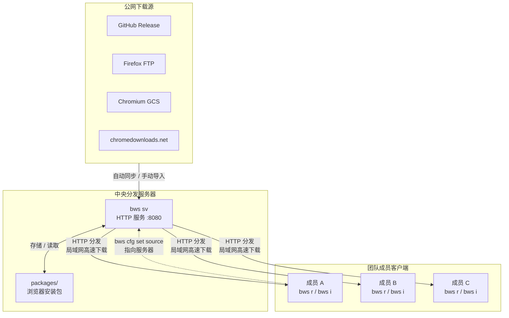

# 团队离线部署方案

在企业内网或无外网访问的环境中，可通过在一台服务器上运行 `bws sv` 搭建中央分发服务，团队成员统一从该服务器获取和运行浏览器版本。

## 架构概览



上图展示了完整的团队离线部署架构：

1. **公网下载源**：GitHub Release、Firefox FTP、Chromium GCS、chromedownloads.net 等官方及第三方源
2. **中央分发服务器**：运行 `bws sv`，负责从公网同步浏览器安装包并存储在 `packages/` 目录
3. **团队成员客户端**：运行 `bws r` / `bws i`，通过局域网从服务器获取浏览器版本
4. **数据流向**：服务器从公网同步 -> 团队成员从服务器安装/运行

## 部署步骤

### 一、服务器端

#### 1. 安装 bws

```bash
# 将 bws 可执行文件放到服务器上，确保有执行权限
# 确认安装成功
bws version
```

#### 2. 配置 bws-serve.ini

首次运行 `bws sv` 会自动生成默认配置文件，编辑后重新启动即可。

```bash
bws sv
# 输出: 配置文件已创建: /opt/bws/bws-serve.ini
# 编辑配置文件后重新运行
```

推荐的服务端配置：

```ini
[serve]
host = 0.0.0.0
port = 8080
packages-dir =
bin-dir =
sync = true
sync-interval = 24h
sync-browsers = chrome,firefox,chromium
sync-channels = stable
```

关键配置项说明：

| 配置项 | 推荐值 | 说明 |
|--------|--------|------|
| `host` | `0.0.0.0` | 监听所有网卡，允许局域网访问 |
| `port` | `8080` | 服务端口，团队成员通过此端口访问 |
| `sync` | `true` | 启用自动同步，定时从公网拉取最新版本 |
| `sync-interval` | `24h` | 同步间隔，根据团队需要调整 |
| `sync-browsers` | `chrome,firefox` | 只同步团队需要的浏览器 |

#### 3. 启动服务

```bash
bws sv
```

启动后可在浏览器中访问 `http://server:8080` 查看 Web 管理界面，确认服务正常运行。

> 生产环境建议将 `bws sv` 注册为系统服务，实现开机自启和自动重启。详细方法请参考 [Serve 服务](./serve.md#后台运行) 章节。

### 二、客户端

#### 1. 安装 bws

```bash
# 将 bws 可执行文件放到客户端机器上
bws version
```

#### 2. 配置离线源

将 source 指向团队内部分发服务器：

```bash
bws cfg set source http://server:8080
```

将 `server:8080` 替换为实际的分发服务器地址。例如内网 IP 为 `192.168.1.100`：

```bash
bws cfg set source http://192.168.1.100:8080
```

#### 3. 验证连通性

```bash
bws ls --remote
```

如果能看到服务器上的浏览器版本列表，说明配置成功。

### 三、日常使用

配置完成后，团队成员的正常使用流程：

```bash
# 查看服务器上可用的浏览器版本
bws ls --remote

# 安装指定版本
bws i chrome@120

# 运行指定版本
bws r chrome@120

# 查看本地已安装的版本
bws ls
```

客户端配置离线源后，所有 `bws i` 和 `bws ls --remote` 操作会优先从服务器获取，服务器没有的版本自动回退到内置在线源。

## 方案优势

### 节省带宽

服务器从公网只下载一次，局域网内所有成员共享同一份安装包。以 10 人团队安装 Chrome 120 为例，外网下载量从 10 次降低到 1 次，节省约 90% 的外网带宽。

### 加速下载

局域网传输速度通常远高于外网下载速度，客户端从内网服务器获取安装包可以大幅缩短等待时间。

### 版本统一管控

管理员通过控制服务器上同步的浏览器版本和渠道，确保团队所有成员使用一致的浏览器版本，避免因版本差异导致的兼容性问题。结合自动同步策略，可以及时将新版本推送到团队。